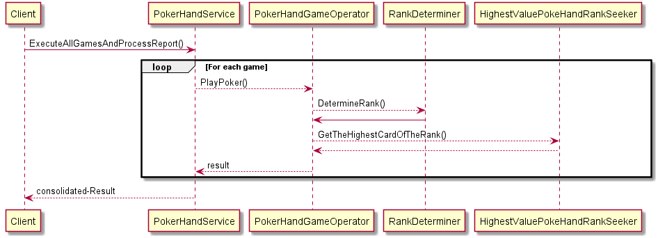
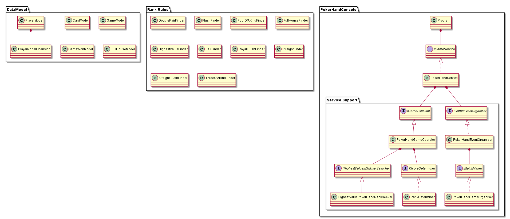

# Argenti Cloud's Poker Hand

## Appreciation:
Thank you for visiting this repository. Your questions can be raised as issues in this github repository or you can email me at vaananart@gmail.com.

Your feedback is much appreciated and helps me to continue to learn and improve.

## Requirements
The requirements for this implementation can be found in the requirements folder.

## Instructions:

Please refer to the [INSTRUCTIONS.md](https://github.com/vaananart/argenti-cloud-poker-hand-sorter/blob/main/INSTRUCTIONS.md)

## Design:

Following is the simple Sequence Diagram for the implementation:

Following is the Class Diagram for the implementation:

** NOTE: this diagrams are generated from PlantUML